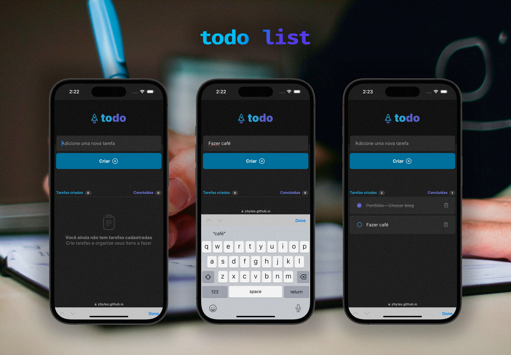

# Todo List

Projeto feito através de desafio proposto no Ignite da RocketSeat na trilha React 2022. A interface foi disponibilizada em Figma, sendo assim, foi necessário desenvolver o layout em React, e as funcionalidades utilizadas foram: imutabilidade, listas e chaves, propriedades e componentização.

## Tecnologias

- React

## Como executar

- Clone o repositório
- Instale as dependências com `npm install`
- Inicie o servidor com `npm run dev`
